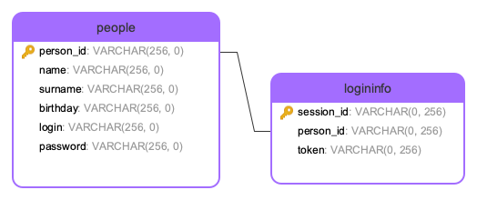

# Сервис аутентификации
## Задание
Сделать API с возможностью авторизации пользователя и получения информации о нем только после успешной авторизации. Должны быть 3 endpoint'а: login (вводим логин и пароль, при успехе выдает токен), logout (делает токен недействительным) и user (при действующем токене выдает информацию о пользователе, имя, фамилию и дату рождения). Сделанный проект надо выгрузить в репозиторий на Github.

Требования к функционалу:
- если логин/пароль неправильные - выводим ошибку
- одновременная поддержка нескольких сессий пользователя
- защита от брутфорса (подбора пароля)

Требования к коду:
- нативный код без использования ФРЕЙМВОРКОВ, БИБЛИОТЕК
- простая реализация логики

Требования к БД:
- простая и понятная структура данных
- использование индексов
- не хранить пароли в базе в открытом виде

Реализация должна быть на Python.

## Запуск программы
Для первого запуска необходимо создать и заполнить базу, для этого выполните команду:
```bash
python3 table.py
```
Для запуска непосредственно программы выполните команду:
```bash
python3 auth.py
```

Запустится обёртка для операций по авторизации. Далее следуйте подсказкам.

## Комментарии к реализации
_Note:_ Представленый код был написан за ~2 часа, поэтому прошу понять и простить🥲

### База данных
К сожалению, PostgreSQL на М1 приказал долго жить (быстро не починила, но починю), поэтому SQLite из питона.

Касательно архитектуры в базе существуют 2 таблицы:


Требуем `login` уникальным и не `NULL`. `persin_id` является foreign key для таблиц. `session_id` нужно для поддержания нескольких авторизаций одного пользователя. Имя, фамилия и ДР могут быть не заполнены, поэтому нет `NOT NULL`, я не забыла.

`id` для обеих таблиц _VARCHAR_, потому что предполагается, что будет много пользователей. Можно было и _INTEGER_ сделать, главное -- чтобы были уникальными. День рождения можно было хранить, как дату.

Для хранения пароля в БД будем шифровать его с помощью ```SHA256```, это обеспечит безопасное хранение в базе. Не самый надёжный способ, так как реально взломать, но для примера подойдёт.

_P.S. Не заиспользовала индексы, но кажется схема достаточно тривиальна и они там не особо нужны._

### Токен
В качестве токена используется конкатенация логина и таймстампа попытки логина. Первое, что пришло в голову, позволит поддержать несколько сессий одного пользователя.

При логине токен кладётся в базу, что одначается, что пользователь залогинен и сессия действительна. Это позволяет нам проводить проверку, что сессия с данным токеном действительна. При разлогинивании запись с текущим токеном удаляется.

### Брутфорс
В качестве примитивной системы против подбора паролей просто ограничим количество запросов к одному пользователю в секунду. В сетевом варианте можно было бы ограничить запросы с одного IP или по конкретным портам, например.

### TODO
Реализация далеко не perfect, поэтому пишу, что стоило бы привести в порядок в первую очередь:
- Вероятно, пересмотреть типы данных в БД
- Использовать более надёжный шифратор паролей
- Придумать более умную защиту от брутфорса (как минимум хранить не в _dict()_)
- Поддержать whitespace при вводе, чтобы в базу класть без пробелов
- Соптимизировать количество обращений к базе (например, для проверки активности сессии мы открываем базу дважды)
- Возможно, использовать какой-то другой токен
